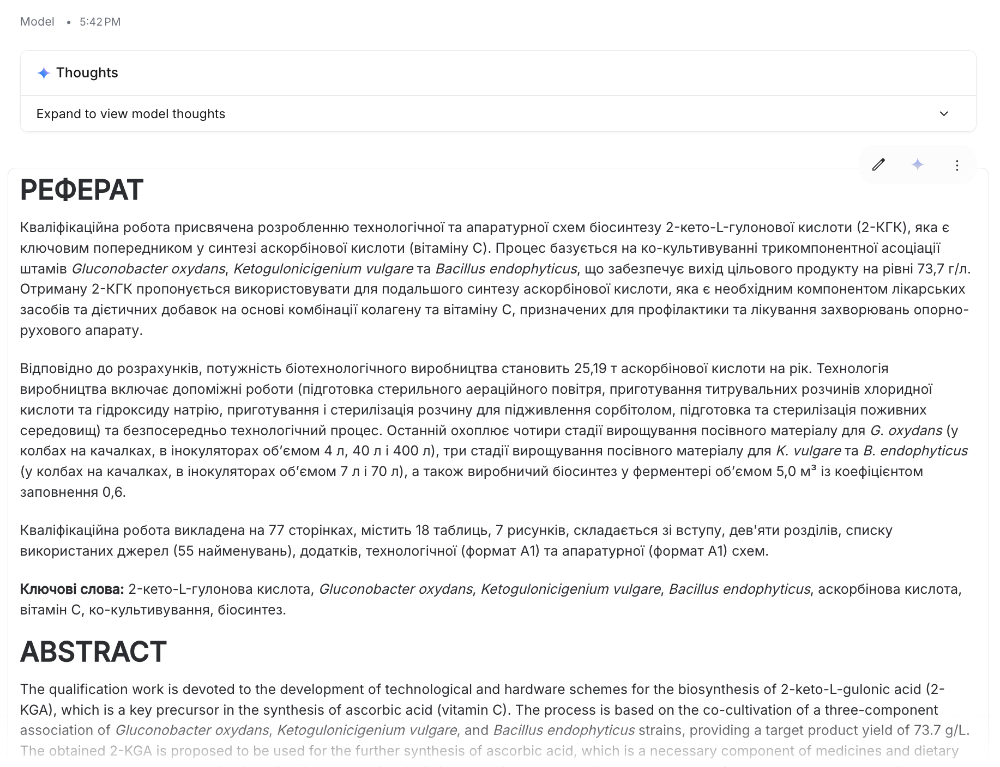
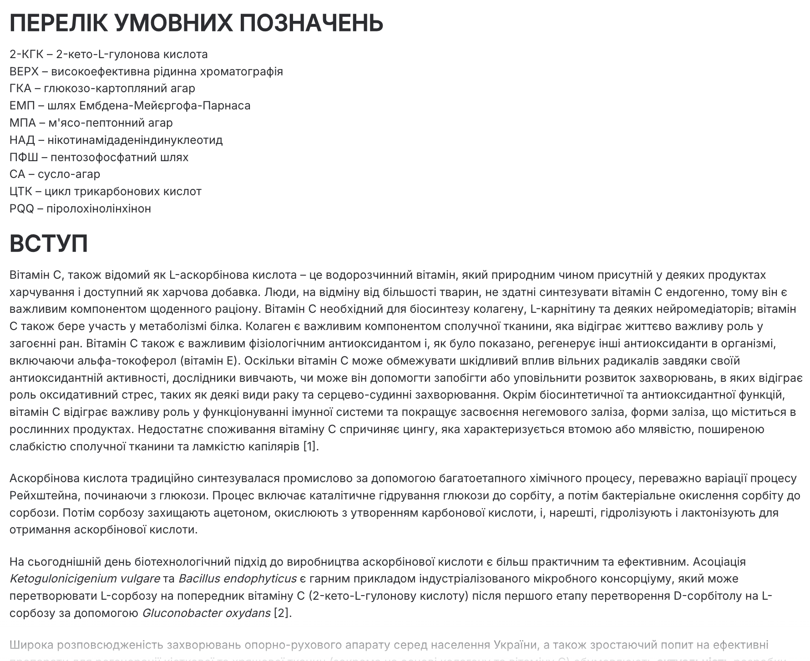
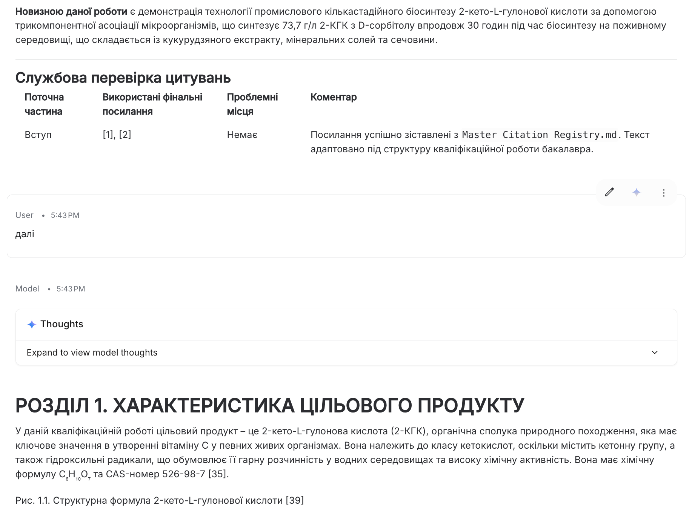
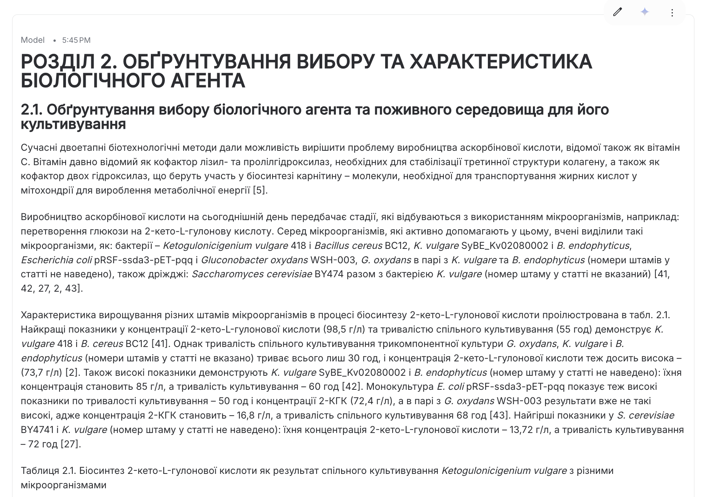
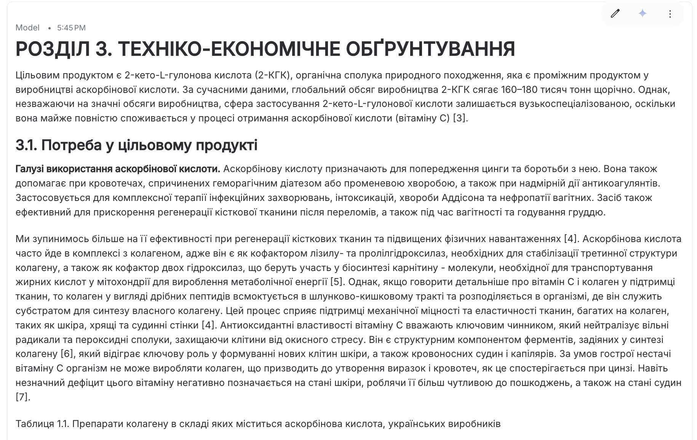

# Bachelor Thesis Assembly Prompt

`Language: EN` `Qualification thesis workflow` `Source file: ДИПЛОМ_ЗАПИСКА.md`

## What This Prompt Is

A Ukrainian master prompt for assembling a complete bachelor qualification thesis from attached materials.

## Purpose

Use it to combine sections, enforce formatting requirements, and produce a defense-ready thesis draft.

## What You Can Generate

- Complete thesis draft
- Structured chapters
- References and appendices
- Formatting compliance checks

## Expected Results

- More coherent final document
- Fewer missing sections
- Cleaner academic structure

## Inputs to Prepare

- All thesis source files
- Department requirements
- Citation materials

## How to Use

- Open the language version you need.
- Copy the full prompt block.
- Attach the files or links expected by the prompt.
- After the first run, fill in any variables or clarifications requested by the model.

## Prompt

Prompt text

~~~markdown
Analyze all attached files.

Your task: to assemble a complete bachelor's qualification work for defense.

The work must be assembled according to the clearly defined structure given below in this prompt.

## Important

Do not generate the qualification work entirely from scratch.

Your task is to assemble a coherent qualification work from provided fragments of other students' works:

- course papers;
- project;
- pre-diploma practice report;
- independent work;
- feasibility study (ТЕО).

Allowed:
- logically connecting fragments;
- removing duplications;
- editing transitions between parts;
- unifying style;
- adapting text to the qualification work structure;
- transferring ready calculations, tables, captions, technological descriptions;
- forming Abstract, List of Conditional Designations, Introduction, and Appendices based on existing materials.

Forbidden:
- inventing new sources;
- adding sources from the internet;
- creating fake bibliographic descriptions;
- changing the content of sources;
- mixing references [1], [2], [3] from different files;
- transferring old numbering of sources directly into the final work;
- creating the list of used sources “by content” or “by eye”.

---

# Role of each attached file

## 1. Primary source files for text assembly

These files are the main sources of text fragments, calculations, tables, technology descriptions, and captions:

- `---`
- `---`
- `---`
- `---`
- `---`

## 2. Style examples

Files:

- `APPENDIX 1.pdf`
- `APPENDIX 2.pdf`
- `APPENDIX 3.pdf`

use as style and structure examples for:

- Abstract;
- List of Conditional Designations;
- Introduction.

## 3. Master Citation Registry

Also attached is the file:

`Master Citation Registry.md`

This is the main source of truth for the final numbering of sources.

It contains:

- final source number;
- Master Source ID;
- full bibliographic description;
- correspondence between original file, old reference, unique ID from Citation Map, and final number.

This file must be used for final references in square brackets.

---

# Algorithm for working with citations

When transferring any text fragment from a primary file, strictly follow this algorithm:

1. Determine from which original file the fragment was taken.
2. Find all old references in this fragment, e.g. [1], [2], [3], [1–4], [2; 5; 7].
3. For each old reference, open the `Master Citation Registry.md` of that file.
4. Find the corresponding unique source ID.
5. Replace the old reference with the final number from `Master Citation Registry.md`.
6. If the old reference is not found in the Master Citation Registry, do not invent a match. Mark it as:

   [CITE_CHECK: filename, old reference]

7. Do not replace references “by content”. Only through `Master Citation Registry.md`.

---

# Rules for final numbering of sources

Final references in the text must be in the format:

[1], [2], [3]

But these numbers must be taken only from `Master Citation Registry.md`.

Do not use old numbers from original files as final numbers.

For example:

If the file had:

Lycopene belongs to carotenoid pigments [3].

And the Citation Map of this file shows:

[3] → KURS-SRC-003

And `Master Citation Registry.md` shows:

KURS-SRC-003 → MASTER-SRC-014 → final reference [14]

Then in the final work it must be:

Lycopene belongs to carotenoid pigments [14].

---

# List of used sources

The list of used sources must be formed only based on `Master Citation Registry.md`.

Do not create the list of used sources independently from memory.

Do not add sources not present in `Master Citation Registry.md`.

Do not add sources from the internet.

Do not replace incomplete bibliographic descriptions with similar ones.

In the final list of used sources, use the bibliographic descriptions given in `Master Citation Registry.md`.

If a certain source was not used in the final text, do not include it in the final list unless explicitly instructed otherwise.

---

# Structure of the qualification work

Assemble the work strictly according to the following structure, preserving the order and titles of sections and subsections:

ABSTRACT
Abstract (in English immediately after the abstract)
LIST OF CONDITIONAL DESIGNATIONS (if needed)
INTRODUCTION
SECTION 1. Characteristics of the target product
SECTION 2. Justification of choice and characteristics of the biological agent
  2.1. Justification of choice of biological agent and nutrient medium for its cultivation
  2.2. Calculation of nutrient medium composition
  2.3. Morphological-cultural and physiological-biochemical features of the biological agent (by agreement with supervisor)
  2.4. Taxonomic status of the biological agent (by agreement with supervisor)
SECTION 3. Techno-economic justification
  3.1. Demand for the target product
  3.2. Calculation of production capacity
  3.3. Calculation of fermenter volume and number of production cycles
  3.4. Calculation of number of stages for preparation of inoculum
SECTION 4. Biosynthesis of the target product (by agreement with supervisor)
  4.1. Catabolism pathways of growth substrate in the biological agent
  4.2. Biotransformation of growth substrate into the target product
SECTION 5. Justification of choice of technological scheme
  5.1. Justification of cultivation method and fermenter type
  5.2. Justification of aeration air preparation stage
  5.3. Justification of preparation and sterilization of nutrient medium
    5.3.1. Features of preparation and sterilization of nutrient medium for obtaining inoculum in shake flasks
    5.3.2. Features of preparation and sterilization of nutrient medium for inoculum cultivation in seed apparatus
    5.3.3. Features of preparation and sterilization of nutrient medium for production biosynthesis
  5.4. Justification of preparation and sterilization of feeding solution
  5.5. Justification of choice of titrating agents for pH regulation during biosynthesis of the target product
  5.6. Justification of choice of antifoam agent
SECTION 6. Equipment specification
SECTION 7. Description of technological scheme
SECTION 8. Main stages of isolation and purification of the target product
SECTION 9. Production control
  9.1. Microbiological control
  9.2. Indicators of growth and synthesis of the target product
    9.2.1. Biomass concentration
    9.2.2. Target product concentration
    9.2.3. Concentration of carbon and nitrogen sources
LITERATURE
APPENDICES

---

# Rules for working with tables and figures

1. If source files contain figures, do not insert the figure itself.
2. Leave only the original caption for the figure.
3. If a table is large, i.e. has more than 10 rows or more than 10 columns, do not reproduce it fully.
4. For large tables, leave only the original caption.
5. If the table is short, it can be transferred into the text.
6. Do not invent new tables if they do not arise from source materials.
7. Do not change numbering of tables and figures chaotically. If numbering needs to be adapted to the final structure, do it sequentially.

---

# Style rules

Style and structure must be identical to those in the primary source files for text assembly.

Preserve technical specifics from primary files:

- producer;
- target product;
- technological parameters;
- calculations;
- composition of nutrient media;
- equipment;
- stages of technological process;
- production control;
- safety requirements;
- environmental aspects;
- economic or techno-economic data, if present in files.

---

# Work in 11 responses

Perform the task in 11 separate responses to my subsequent messages `next`.

In each response, generate the maximum possible amount of text but do not lose control over structure and citations.

Do not repeat already generated parts unless I ask.

Start with the first part of the work.

Approximate distribution:

1. Abstract, Abstract (English), List of Conditional Designations, Introduction.
2. Section 1.
3. Continuation of Section 1 / beginning of Section 2.
4. Section 2.
5. Section 3.
6. Section 4.
7. Section 5.
8. Section 6.
9. Section 7.
10. Sections 8 and 9.
11. Literature, Appendices, final citation check.

Strictly follow the above structure when distributing text between responses. Before generating each next part upon user request, first review `Master Citation Registry.md`.

---

# Service check after each response

After each part, add a service block:

## Service citation check

| Current part | Used final references | Problematic places | Comment |
|---|---|---|---|

In this block indicate:

- which final sources were used;
- whether there were references that could not be matched;
- whether there are marks [CITE_CHECK], [MASTER_SOURCE_MISSING], or [SOURCE_NEEDED].

This service block is not part of the diploma work. It is needed only for quality control.

---

# Start execution

Before generating the first part:

1. Briefly confirm that you see:
   - primary files;
   - appendix examples;
   - Citation Map for each primary file;
   - `Master Citation Registry.md`.

2. If any of these elements are missing, do not start generating the work, but report what exactly is missing.

3. If all are present, start with Part 1:
   - Abstract;
   - Abstract (English);
   - List of Conditional Designations;
   - Introduction.
~~~

## Examples and Demo Materials

Relevant PNG/PDF or PPTX materials are included below for personal review of what this prompt can generate or support.

### View PNG demo: `24.png`

### View PNG demo: `24.1.png`

### View PNG demo: `24.2.png`

### View PNG demo: `24.3.png`

### View PNG demo: `24.4.png`

## Related Versions

- [Українська версія](../uk/bachelor-thesis-assembly-prompt.md)
- [Category: Qualification thesis workflow](../../categories/qualification-thesis-workflow.md)
- [All prompts](../../prompts/index.md)

## Source

Original local source: [ДИПЛОМ_ЗАПИСКА.md](../../source/%D0%94%D0%98%D0%9F%D0%9B%D0%9E%D0%9C_%D0%97%D0%90%D0%9F%D0%98%D0%A1%D0%9A%D0%90.md)
