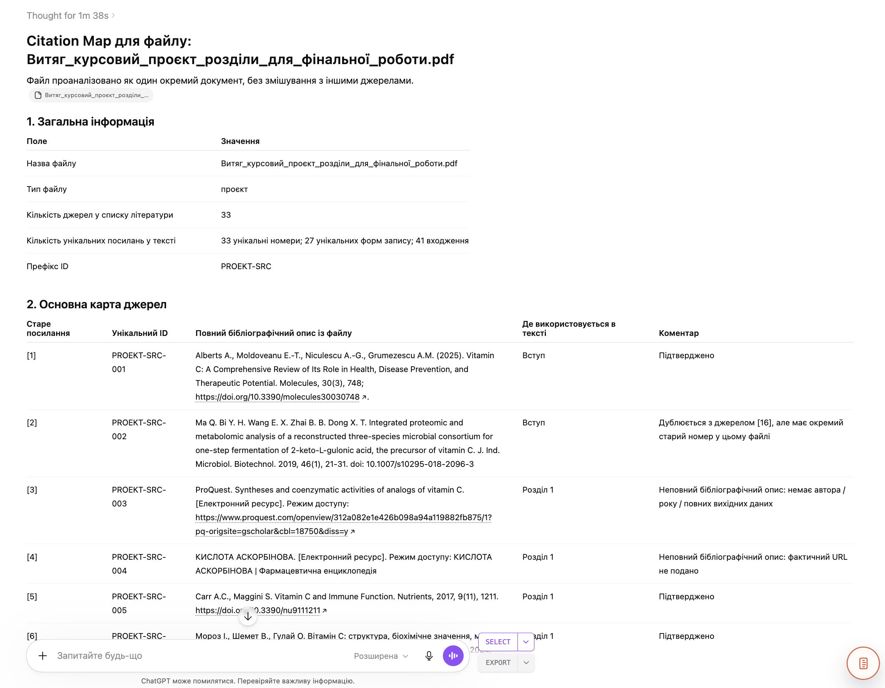
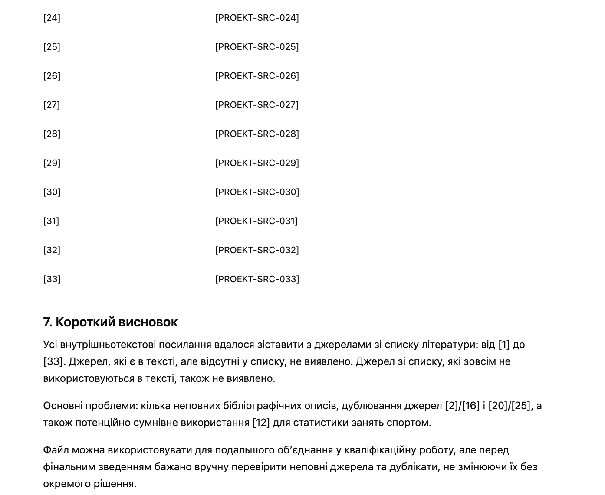

# Citation Extract Technical Auditor

`Language: EN` `Academic extraction and citation control` `Source file: ВИТЯГ.md`

## What This Prompt Is

A Ukrainian prompt for extracting and auditing citation-related material from separate academic work parts.

## Purpose

Use it to prepare a clean citation map and verify whether sources are tied to actual text fragments.

## What You Can Generate

- Citation map
- Source-fragment links
- Technical citation audit

## Expected Results

- Fewer unsupported references
- Clearer source usage
- Easier final bibliography cleanup

## Inputs to Prepare

- Academic work parts
- References or citations
- Target extraction scope

## How to Use

- Open the language version you need.
- Copy the full prompt block.
- Attach the files or links expected by the prompt.
- After the first run, fill in any variables or clarifications requested by the model.

## Prompt

Prompt text

~~~markdown
You work as a bibliographic editor and technical auditor of citations.

My task: I am collecting a qualification paper from several separate student files: term papers, reports, projects, and independent works. Each file contains its own in-text citations in square brackets, for example [1], [2], [3], as well as its own list of references.

Critically important:
- do not mix sources from other files;
- work only with ONE provided file;
- do not invent sources;
- do not change the content of bibliographic descriptions without necessity;
- do not renumber sources in the final list;
- do not create a new bibliography;
- do not replace sources with “similar” ones;
- if a source is incomplete, mark this in a comment, but do not invent missing data.

## Filename for analysis:
[INSERT FILE NAME]

## Prefix for unique IDs:
[INSERT PREFIX]

For example:
- if this is a term paper, you can use `KURS-SRC`;
- if this is a practice report — `ZVIT-SRC`;
- if this is a project — `PROEKT-SRC`;
- if this is an independent work — `SAM-SRC`;
- if these are methodological recommendations — `METOD-SRC`.

## Task

Analyze the provided file and create a Citation Map — a correspondence map between old in-text citations and the actual sources from the reference list of the same file.

You need to perform the following actions:

1. Find all in-text citations in square brackets:
   - [1]
   - [2]
   - [3]
   - [1, 2]
   - [1–3]
   - [1; 4; 7]
   - other similar variants.

2. Find the list of references in the same file.

3. For each source in the list, create a unique ID in the following format:

   `[PREFIX]-001`, `[PREFIX]-002`, `[PREFIX]-003`

   For example:

   `KURS-SRC-001`  
   `KURS-SRC-002`  
   `KURS-SRC-003`

4. Match the old citation number with the corresponding source from the reference list.

5. Determine where in the text each source is used:
   - Abstract;
   - Introduction;
   - Section 1;
   - Section 2;
   - Section 3;
   - Conclusions;
   - Appendices;
   - or another structural element if present in the file.

6. If a source is in the reference list but not used in the text, mark:
   `Not found in text`.

7. If a citation is in the text but the corresponding source is missing from the reference list, mark:
   `ERROR: source missing from list`.

8. If a source looks incomplete, for example missing year, title, URL, author, or publisher, do not correct it yourself, but mark in a comment:
   `Incomplete bibliographic description`.

## Response format

Form the response strictly in Markdown with the following structure:

# Citation Map for file: [File Name]

## 1. General Information

| Field | Value |
|---|---|
| Filename |  |
| File type | term paper / report / project / independent work / other |
| Number of sources in reference list |  |
| Number of unique citations in text |  |
| ID Prefix |  |

## 2. Main Source Map

| Old citation | Unique ID | Full bibliographic description from file | Where used in text | Comment |
|---|---|---|---|---|
| [1] | [PREFIX]-001 |  |  |  |
| [2] | [PREFIX]-002 |  |  |  |
| [3] | [PREFIX]-003 |  |  |  |

## 3. Citations found in text

| Citation in text | Section / place of use | Corresponding unique ID | Status |
|---|---|---|---|
| [1] |  |  | confirmed / problem |
| [2] |  |  | confirmed / problem |

## 4. Sources from the list not found in text

| Old number | Unique ID | Bibliographic description | Comment |
|---|---|---|---|

## 5. Problematic or doubtful places

| Problem | Where found | Comment |
|---|---|---|
| Citation is in text but no source in list |  |  |
| Source is in list but not used in text |  |  |
| Bibliographic description incomplete |  |  |
| Citation has unclear format |  |  |

## 6. Ready table for further citation replacement

Form a separate table that can be used for automatic or semi-automatic replacement of old citations with unique IDs.

| What to replace | Replace with |
|---|---|
| [1] | [[PREFIX]-001] |
| [2] | [[PREFIX]-002] |
| [3] | [[PREFIX]-003] |

## 7. Short conclusion

Write briefly:
- whether it was possible to fully match all citations;
- what problems were found;
- whether this file can be safely used for further merging into the qualification paper.

Important:
do not proceed to generating the qualification paper.
Your task is only to create a Citation Map for one specific file.
~~~

## Examples and Demo Materials

Relevant PNG/PDF or PPTX materials are included below for personal review of what this prompt can generate or support.

### View PNG demo: `1.png`

### View PNG demo: `1.1.png`

## Related Versions

- [Українська версія](../uk/citation-extract-technical-auditor.md)
- [Category: Academic extraction and citation control](../../categories/academic-extraction-and-citation-control.md)
- [All prompts](../../prompts/index.md)

## Source

Original local source: [ВИТЯГ.md](../../source/%D0%92%D0%98%D0%A2%D0%AF%D0%93.md)
