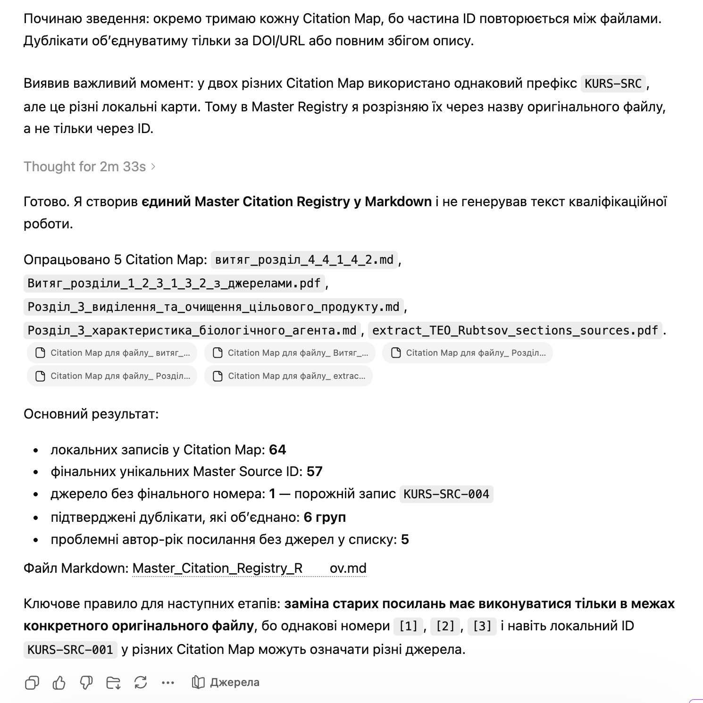

# Citation Map Merger

`Language: EN` `Academic extraction and citation control` `Source file: ОБʼЄДНАННЯ ВИТЯГІВ.md`

## What This Prompt Is

A Ukrainian prompt for merging several citation maps into one consistent bibliography-audit artifact.

## Purpose

Use it after separate extraction passes to consolidate duplicated sources, fragments, and citation evidence.

## What You Can Generate

- Unified citation map
- Deduplicated source list
- Citation consistency notes

## Expected Results

- Less duplication
- Clearer bibliography basis
- More reliable final citation audit

## Inputs to Prepare

- Several citation maps
- Primary-source extraction outputs

## How to Use

- Open the language version you need.
- Copy the full prompt block.
- Attach the files or links expected by the prompt.
- After the first run, fill in any variables or clarifications requested by the model.

## Prompt

Prompt text

~~~markdown
You work as a bibliographic editor and citation auditor.

I provide you with several separate Citation Maps, created for each primary file separately.

Goal: to create a single Master Citation Registry — the main table of sources, which will be the single source of truth for the final qualification work.

## Critically Important Rules

1. Do not use original numbers [1], [2], [3] as final numbers.
2. Remember that [1] in different files may refer to different sources.
3. Each source must be identified through:
   - the original file name;
   - the old citation number;
   - the unique ID from the Citation Map;
   - the full bibliographic description.
4. Do not invent sources.
5. Do not add new sources from the internet.
6. Do not replace incomplete sources with similar ones.
7. If sources look identical, merge them only when at least one of the following matches:
   - DOI;
   - URL;
   - authors + year + title;
   - fully identical bibliographic description.
8. If in doubt, do not merge sources; leave them separate and mark in the comment: `possible duplicate, requires verification`.
9. Final source numbers must be created not based on old numbers, but as a new continuous numbering for the future qualification work.

## Input Files

Analyze all attached Citation Maps for the following source files:

- `---`
- `---`
- `---`
- `---`
- `---`

## Task

Form a single Master Citation Registry in Markdown.

## Response Structure

# Master Citation Registry

## 1. Main list of final sources

| Final Number | Master Source ID | Full Bibliographic Description | Source File | Comment |
|---:|---|---|---|---|
| [1] | MASTER-SRC-001 |  |  |  |
| [2] | MASTER-SRC-002 |  |  |  |
| [3] | MASTER-SRC-003 |  |  |  |

## 2. Table of correspondence between old citations and final numbers

| Original File | Old Citation in File | Unique ID from Citation Map | Master Source ID | Final Citation |
|---|---|---|---|---|
|  | [1] |  | MASTER-SRC-001 | [1] |
|  | [2] |  | MASTER-SRC-002 | [2] |

## 3. Possible duplicates

| Source 1 | Source 2 | Reason for suspicion | Decision |
|---|---|---|---|

## 4. Problematic sources

| Source | Problem | What needs to be checked |
|---|---|---|

## 5. Rules for further generation of the thesis

Form a short list of rules on how in the next prompts old citations from primary files should be replaced with final citations.

Important:
do not generate the qualification work at this stage.
Your task is only to create the Master Citation Registry.
~~~

## Examples and Demo Materials

Relevant PNG/PDF or PPTX materials are included below for personal review of what this prompt can generate or support.

### View PNG demo: `2.png`

## Related Versions

- [Українська версія](../uk/citation-map-merger.md)
- [Category: Academic extraction and citation control](../../categories/academic-extraction-and-citation-control.md)
- [All prompts](../../prompts/index.md)

## Source

Original local source: [ОБʼЄДНАННЯ ВИТЯГІВ.md](../../source/%D0%9E%D0%91%CA%BC%D0%84%D0%94%D0%9D%D0%90%D0%9D%D0%9D%D0%AF%20%D0%92%D0%98%D0%A2%D0%AF%D0%93%D0%86%D0%92.md)
