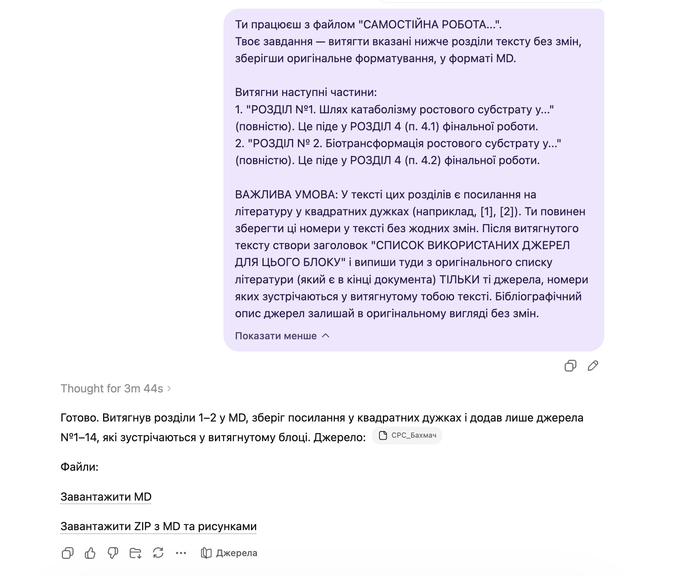

# Independent Work Extraction Prompt

`Language: EN` `Extraction prompts` `Source file: Самостійна робота_для витягу.md`

## What This Prompt Is

A Ukrainian prompt for extracting selected sections from an independent-work document.

## Purpose

Use it to preserve exact source text for later academic assembly or analysis.

## What You Can Generate

- Verbatim extracts
- Preserved formatting
- Reusable source text

## Expected Results

- Cleaner downstream synthesis
- Less source distortion
- Better traceability

## Inputs to Prepare

- Independent work file
- Target sections

## How to Use

- Open the language version you need.
- Copy the full prompt block.
- Attach the files or links expected by the prompt.
- After the first run, fill in any variables or clarifications requested by the model.

## Prompt

Prompt text

~~~markdown
You are working with the file "INDEPENDENT WORK...".
Your task is to extract the sections of the text specified below without changes, preserving the original formatting, in MD format.

Extract the following parts:
1. "SECTION №1. The pathway of catabolism of the growth substrate in..." (in full). This will go into SECTION 4 (item 4.1) of the final work.
2. "SECTION № 2. Biotransformation of the growth substrate in..." (in full). This will go into SECTION 4 (item 4.2) of the final work.

IMPORTANT CONDITION: In the text of these sections, there are references to literature in square brackets (for example, [1], [2]). You must keep these numbers in the text without any changes. After the extracted text, create a heading "LIST OF SOURCES USED FOR THIS BLOCK" and list there from the original bibliography (which is at the end of the document) ONLY those sources whose numbers appear in the text you extracted. Leave the bibliographic description of the sources in the original form without changes.
~~~

## Examples and Demo Materials

Relevant PNG/PDF or PPTX materials are included below for personal review of what this prompt can generate or support.

### View PNG demo: `10.png`

## Related Versions

- [Українська версія](../uk/independent-work-extraction.md)
- [Category: Extraction prompts](../../categories/extraction-prompts.md)
- [All prompts](../../prompts/index.md)

## Source

Original local source: [Самостійна робота_для витягу.md](../../source/%D0%A1%D0%B0%D0%BC%D0%BE%D1%81%D1%82%D1%96%D0%B8%CC%86%D0%BD%D0%B0%20%D1%80%D0%BE%D0%B1%D0%BE%D1%82%D0%B0_%D0%B4%D0%BB%D1%8F%20%D0%B2%D0%B8%D1%82%D1%8F%D0%B3%D1%83.md)
