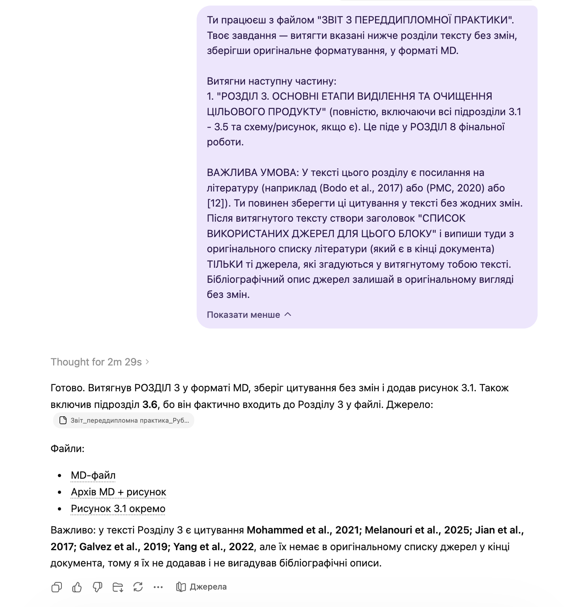

# Pre-Diploma Practice Extraction Prompt

`Language: EN` `Extraction prompts` `Source file: Звіт з переддипломної практики_для витягу.md`

## What This Prompt Is

A Ukrainian extraction prompt for copying specified sections from a pre-diploma practice report without rewriting them.

## Purpose

Use it to extract source text for later assembly into a thesis or related document.

## What You Can Generate

- Exact section extract
- Preserved formatting
- Source-ready text block

## Expected Results

- Less accidental rewriting
- Cleaner downstream assembly
- Better source traceability

## Inputs to Prepare

- Pre-diploma practice report file
- Requested sections

## How to Use

- Open the language version you need.
- Copy the full prompt block.
- Attach the files or links expected by the prompt.
- After the first run, fill in any variables or clarifications requested by the model.

## Prompt

Prompt text

~~~markdown
You are working with the file "REPORT ON PRE-GRADUATION PRACTICE".
Your task is to extract the specified sections of the text below unchanged, preserving the original formatting, in MD format.

Extract the following part:
1. "SECTION 3. MAIN STAGES OF ISOLATION AND PURIFICATION OF THE TARGET PRODUCT" (completely, including all subsections 3.1 - 3.5 and any scheme/figure, if present). This will go into SECTION 8 of the final work.

IMPORTANT CONDITION: In the text of this section, there are references to literature (for example (Bodo et al., 2017) or (PMC, 2020) or [12]). You must keep these citations in the text without any changes. After the extracted text, create a heading "LIST OF SOURCES USED FOR THIS BLOCK" and list there from the original bibliography list (which is at the end of the document) ONLY those sources that are mentioned in the text you extracted. Leave the bibliographic descriptions of the sources in their original form without changes.
~~~

## Examples and Demo Materials

Relevant PNG/PDF or PPTX materials are included below for personal review of what this prompt can generate or support.

### View PNG demo: `11.png`

## Related Versions

- [Українська версія](../uk/pre-diploma-practice-extraction.md)
- [Category: Extraction prompts](../../categories/extraction-prompts.md)
- [All prompts](../../prompts/index.md)

## Source

Original local source: [Звіт з переддипломної практики_для витягу.md](../../source/%D0%97%D0%B2%D1%96%D1%82%20%D0%B7%20%D0%BF%D0%B5%D1%80%D0%B5%D0%B4%D0%B4%D0%B8%D0%BF%D0%BB%D0%BE%D0%BC%D0%BD%D0%BE%D1%96%CC%88%20%D0%BF%D1%80%D0%B0%D0%BA%D1%82%D0%B8%D0%BA%D0%B8_%D0%B4%D0%BB%D1%8F%20%D0%B2%D0%B8%D1%82%D1%8F%D0%B3%D1%83.md)
