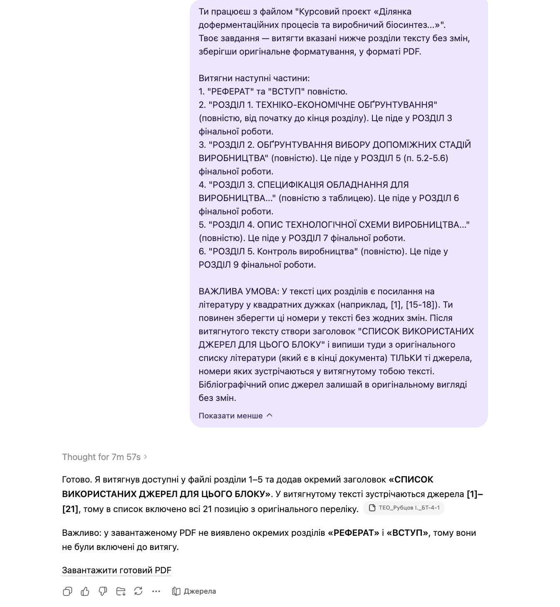

# Pre-Fermentation Course Project Extraction Prompt

`Language: EN` `Extraction prompts` `Source file: Курсовий проєкт "Ділянка доферментаційних процесів"_для витягу.md`

## What This Prompt Is

A Ukrainian extraction prompt for a course project about pre-fermentation processes and production biosynthesis.

## Purpose

Use it to copy specified project sections exactly for later thesis or report assembly.

## What You Can Generate

- Exact project-section extracts
- Preserved formatting
- Source-aligned material

## Expected Results

- More reliable section reuse
- Less accidental paraphrasing
- Clearer extraction boundaries

## Inputs to Prepare

- Course project file
- Requested sections

## How to Use

- Open the language version you need.
- Copy the full prompt block.
- Attach the files or links expected by the prompt.
- After the first run, fill in any variables or clarifications requested by the model.

## Prompt

Prompt text

~~~markdown
You are working with the file "Course Project 'Section of Pre-Fermentation Processes and Industrial Biosynthesis...'".
Your task is to extract the specified sections of the text below without changes, preserving the original formatting, in PDF format.

Extract the following parts:
1. "ABSTRACT" and "INTRODUCTION" in full.
2. "SECTION 1. TECHNICAL AND ECONOMIC JUSTIFICATION" (completely, from the beginning to the end of the section). This will go into SECTION 3 of the final work.
3. "SECTION 2. JUSTIFICATION OF THE CHOICE OF AUXILIARY PRODUCTION STAGES" (completely). This will go into SECTION 5 (items 5.2-5.6) of the final work.
4. "SECTION 3. SPECIFICATION OF EQUIPMENT FOR PRODUCTION..." (completely with the table). This will go into SECTION 6 of the final work.
5. "SECTION 4. DESCRIPTION OF THE TECHNOLOGICAL PRODUCTION SCHEME..." (completely). This will go into SECTION 7 of the final work.
6. "SECTION 5. Production Control" (completely). This will go into SECTION 9 of the final work.

IMPORTANT CONDITION: In the text of these sections, there are references to literature in square brackets (for example, [1], [15-18]). You must keep these numbers in the text without any changes. After the extracted text, create a heading "LIST OF SOURCES USED FOR THIS BLOCK" and list there from the original bibliography list (which is at the end of the document) ONLY those sources whose numbers appear in the text you extracted. Leave the bibliographic descriptions of the sources in their original form without changes.
~~~

## Examples and Demo Materials

Relevant PNG/PDF or PPTX materials are included below for personal review of what this prompt can generate or support.

### View PNG demo: `12.png`

## Related Versions

- [Українська версія](../uk/pre-fermentation-course-project-extraction.md)
- [Category: Extraction prompts](../../categories/extraction-prompts.md)
- [All prompts](../../prompts/index.md)

## Source

Original local source: [Курсовий проєкт "Ділянка доферментаційних процесів"_для витягу.md](../../source/%D0%9A%D1%83%D1%80%D1%81%D0%BE%D0%B2%D0%B8%D0%B8%CC%86%20%D0%BF%D1%80%D0%BE%D1%94%D0%BA%D1%82%20%22%D0%94%D1%96%D0%BB%D1%8F%D0%BD%D0%BA%D0%B0%20%D0%B4%D0%BE%D1%84%D0%B5%D1%80%D0%BC%D0%B5%D0%BD%D1%82%D0%B0%D1%86%D1%96%D0%B8%CC%86%D0%BD%D0%B8%D1%85%20%D0%BF%D1%80%D0%BE%D1%86%D0%B5%D1%81%D1%96%D0%B2%22_%D0%B4%D0%BB%D1%8F%20%D0%B2%D0%B8%D1%82%D1%8F%D0%B3%D1%83.md)
