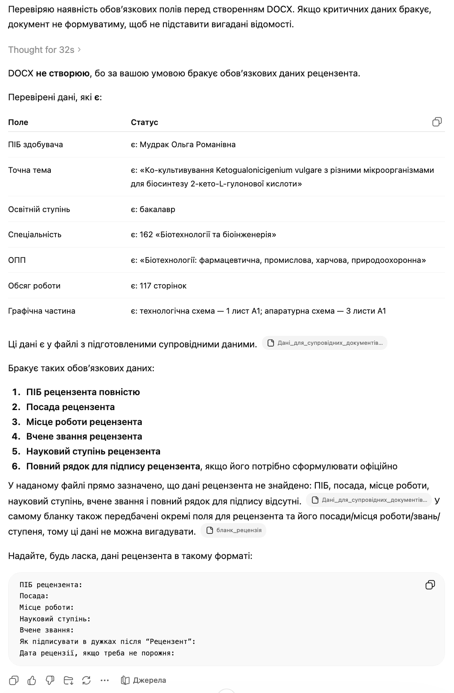
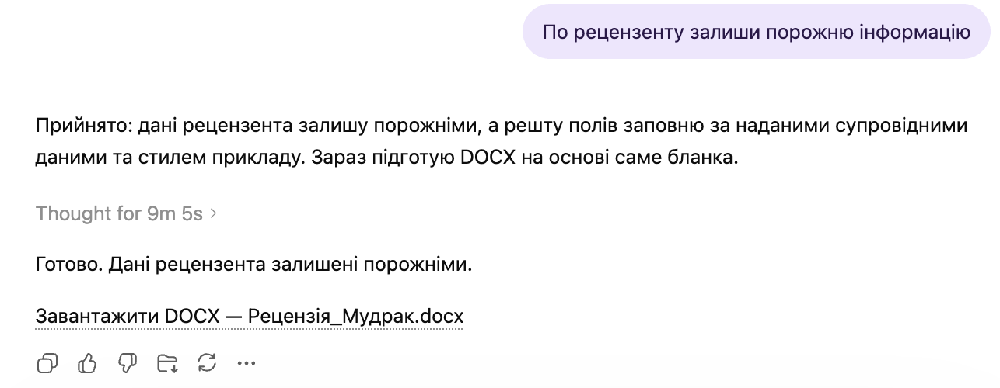

# Qualification Review Form Filler

`Language: EN` `Qualification document forms` `Source file: Мета-промпт_рецензії.md`

## What This Prompt Is

A Ukrainian prompt for filling a reviewer form for a qualification thesis.

## Purpose

Use it to draft a structured review using the provided blank, example, and thesis data.

## What You Can Generate

- Completed review form
- Strengths and remarks
- Example-aligned wording

## Expected Results

- More consistent review tone
- Faster form completion
- Fewer unsupported comments

## Inputs to Prepare

- Blank review DOCX
- Example DOCX
- Thesis data

## How to Use

- Open the language version you need.
- Copy the full prompt block.
- Attach the files or links expected by the prompt.
- After the first run, fill in any variables or clarifications requested by the model.

## Prompt

Prompt text

~~~markdown
Your task: fill out the review form for the qualification work.

Input files:
1. Review form DOCX.
2. Example filled file DOCX.
3. General data of the candidate in text format.

Output format: DOCX.
Output file name: Review_{Surname}.docx

Before generation, check if all necessary data are present:
- Full name of the candidate;
- exact topic of the qualification work;
- educational degree;
- specialty;
- educational-professional program (ОПП);
- volume of work in pages;
- graphical part;
- reviewer data: full name, position, workplace, academic title, scientific degree;

If at least one field is missing, do not create the DOCX. Clearly state which data are missing.

Filling rules:
- Fill in the form itself, do not create a document from scratch.
- Preserve the structure, fields, underlines, spacing, font (Times New Roman), and formatting of the form.
- Use the example file for the style and structure of review texts in the following sections:
  - description of the graphical part;
  - conclusion on the compliance of the completed work with the task and requirements;
  - general characteristics of the work: relevance, scientific and/or practical value;
  - analysis of the content of the qualification work;
  - list of main shortcomings;
  - overall conclusion on the qualification work;
  - conclusion on the possibility of awarding the educational qualification.
- In the header of the review direction, in the candidate's line, indicate the SURNAME and first name and patronymic of the candidate in italics.
- Do not copy from the example other people's full names, topic, product, microorganism, reviewer, or content statements unrelated to the current work.
- The topic title in the review must be in italics.
- Names of microorganisms, for example Aspergillus niger, should be italicized throughout the document.
- Do not destroy the numbering in the section "List of main shortcomings." Shortcomings must be separate numbered items.
- All additionally generated main text of the review must be in Times New Roman font.
- Do not invent reviewer data.
- Bold formatting of field names does not carry over to inserted text in gaps. Text in font size 10 does not carry over to inserted text in gaps.
~~~

## Examples and Demo Materials

Relevant PNG/PDF or PPTX materials are included below for personal review of what this prompt can generate or support.

### View PNG demo: `19.png`

### View PNG demo: `19.1.png`

## Related Versions

- [Українська версія](../uk/qualification-review-form-filler.md)
- [Category: Qualification document forms](../../categories/qualification-document-forms.md)
- [All prompts](../../prompts/index.md)

## Source

Original local source: [Мета-промпт_рецензії.md](../../source/%D0%9C%D0%B5%D1%82%D0%B0-%D0%BF%D1%80%D0%BE%D0%BC%D0%BF%D1%82_%D1%80%D0%B5%D1%86%D0%B5%D0%BD%D0%B7%D1%96%D1%96%CC%88.md)
