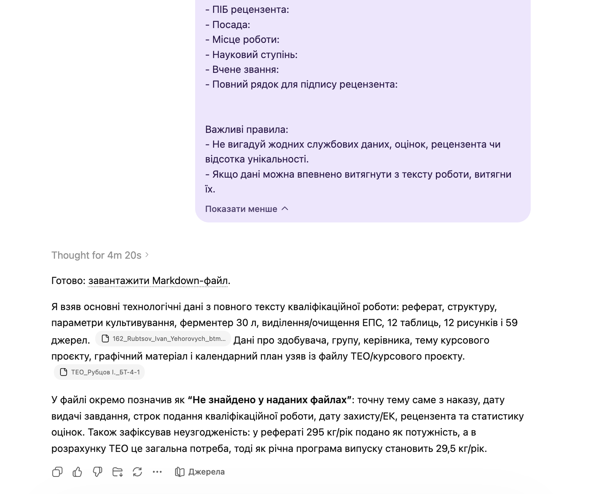

# Qualification Work Parts Analysis

`Language: EN` `Qualification thesis workflow` `Source file: Мета-промпт_аналіз частин робіт.md`

## What This Prompt Is

A Ukrainian prompt for analyzing all provided thesis parts and producing one structured Markdown data file.

## Purpose

Use it to extract key thesis metadata, parameters, sections, keywords, and document-form data.

## What You Can Generate

- Structured Markdown summary
- Form-ready metadata
- Section and parameter inventory

## Expected Results

- Faster document-form completion
- Better overview of thesis state
- Reduced missing data

## Inputs to Prepare

- All thesis parts
- Source files
- Target document requirements

## How to Use

- Open the language version you need.
- Copy the full prompt block.
- Attach the files or links expected by the prompt.
- After the first run, fill in any variables or clarifications requested by the model.

## Prompt

Prompt text

~~~markdown
Your task: analyze all provided parts of the qualification work and create a single structured Markdown file with data that can later be used to fill out accompanying documents: title page, assignment, submission to the head of the EC (Examination Committee), review, summary, and topic application. **If some data are missing in the files, inform the user about this and ask for the corresponding data.**

Output format: MD.
Output filename: Data_for_accompanying_documents_{Surname}.md

Do not fill DOCX documents.

Analyze all attached files:
- separate parts of the qualification work.
- Order with exact topic titles. Find the exact topic title by the surname and name of the candidate from the attached files.

Form the Markdown strictly according to the following structure:

# Data for filling out accompanying documents

## 1. Candidate identification

- Full name:
- First name and SURNAME:
- Course:
- Group:

## 2. Qualification work topic

- Exact topic:
- Microorganisms in the topic:
- Target product:
- Industry / product purpose:

## 3. Supervisor

- Full name of the supervisor:
- First name and SURNAME of the supervisor:
- Surname and initials of the supervisor:
- Position:
- Academic degree:
- Academic title:

## 4. Order and deadlines

- Order number approving the topic: 199кс
- Order date: 30.03.2026
- Assignment issue date:
- Work submission deadline:
- Approximate defense / submission date to EC:
- Other official dates found in files:

## 5. Volume and structure of the work

- Work volume in pages:
- Number of tables:
- Number of figures:
- Number of sources:
- Number of appendices:
- Main structural parts of the work:
  - Abstract:
  - Introduction:
  - Chapter 1:
  - Chapter 2:
  - Chapter 3:
  - Chapter 4:
  - Chapter 5:
  - Chapter 6:
  - Chapter 7:
  - Chapter 8:
  - Chapter 9:
  - Conclusions:
  - References:

If the actual structure differs, adapt the list of chapters to the real content of the work.

## 6. Initial data for the work

Form a concise paragraph for the field “Initial data for the work.” It should include:
- materials on which the work is based;
- target product;
- biological agent;
- strain;
- cultivation method;
- key technological parameters;
- fermenter volume;
- productivity or capacity, if specified.

Text to insert:
> 

## 7. Contents of the explanatory note

Form ready text for the field “Contents of the explanatory note (list of issues to be developed).”

The text should be structured in the style of an accompanying document, not as the full content of the work.

Text to insert:
> 

## 8. Graphic material

Extract only those graphic materials needed for accompanying documents.

Rules:
- for the “Assignment” indicate only the technological scheme and apparatus scheme;
- do not include the biotransformation scheme, presentation, or other materials unless explicitly required;
- for the “Review” you may briefly describe the graphic part in a generalized form.

### For the assignment

- Technological scheme:
- Apparatus scheme:

Ready text to insert:
> 

### For the review

Ready text to insert:
> 

## 9. Calendar plan

Form a calendar plan for the assignment.

Rules:
- stages must correspond to the actual execution of the work;
- stage texts should be neutral, official, without excessive detail: from CHAPTER 1 and its title to CHAPTER 9 (CHAPTER 1. Characterization of the target product; CHAPTER 2. Justification of choice and characterization of the biological agent; CHAPTER 3. Techno-economic justification; CHAPTER 4. Biosynthesis of the target product; CHAPTER 5. Justification of the choice of technological scheme and auxiliary stages; CHAPTER 6. Equipment specification; CHAPTER 7. Description of the phytase production technological scheme; CHAPTER 8. Main stages of isolation and purification of the target product; CHAPTER 9. Production control). Then "Formatting the list of literary sources," "Formatting the introduction and abstract," "Formatting the presentation," and "Formatting the explanatory note."

| № | Stage name | Execution deadline | Note |
|---|---|---|---|
| 1 |  |  | Completed |
| 2 |  |  | Completed |
| 3 |  |  | Completed |
| 4 |  |  | Completed |
| 5 |  |  | Completed |
| 6 |  |  | Completed |
| 7 |  |  | Completed |
| 8 |  |  | Completed |
| 9 |  |  | Completed |
| 10 |  |  | Completed |

## 10. Data for summary

### Short annotation

Form a specific annotation in the style of the summary example. It should include:
- work topic;
- target product;
- microorganism and strain;
- cultivation method;
- product purpose;
- key technological parameters;
- fermenter volume;
- practical value;
- work volume, number of tables, figures, and sources.

Text to insert:
> 

### Brief introduction / description of the completed work

Text to insert:
> 

### Practical or scientific-practical value

Text to insert:
> 

### Keywords

Provide separated by commas. Names of microorganisms must be clearly marked as requiring italics in DOCX.

Keywords:
- 

## 12. Data for review

Form texts for the review sections. The style should be official, restrained, as in the review example.

### Conclusion on compliance of the completed work with the assignment and requirements

> 

### General characteristics of the work: relevance, scientific and/or practical value

> 

### Analysis of the qualification work content

> 

### List of main shortcomings

Provide as a numbered list, not a single paragraph. Clearly specify shortcomings with numerical data from the files.

1. 
2. 

### Overall conclusion on the qualification work

> 

### Conclusion on the possibility of awarding the educational qualification

> 

## 13. Data for submission to the head of the EC

- First name and SURNAME of the candidate for “Sent to…”:
- First name and SURNAME of the candidate for “Certificate of academic performance…”:
- First name and SURNAME of the supervisor:
- First name and SURNAME of the candidate in the required case for “Qualification work of the candidate…”:
- Supervisor’s conclusion:

Supervisor’s conclusion text:
> 

### Grade statistics

If grade statistics are not in the files, do not invent.

- National scale:
  - excellent:
  - good:
  - satisfactory:
- ECTS:
  - A:
  - B:
  - C:
  - D:
  - E:

## 14. Data for topic application

- Full name of the candidate:
- Academic group:
- Application topic:
- Supervisor in the format “degree / position + surname and initials”:
- Application date:

## 15. Reviewer

If reviewer data are not in the files, do not invent.

- Full name of the reviewer:
- Position:
- Workplace:
- Academic degree:
- Academic title:
- Full line for reviewer’s signature:

Important rules:
- Do not invent any official data, grades, reviewer, or uniqueness percentage.
- If data can be confidently extracted from the work text, extract them.
~~~

## Examples and Demo Materials

Relevant PNG/PDF or PPTX materials are included below for personal review of what this prompt can generate or support.

### View PNG demo: `25.png`

## Related Versions

- [Українська версія](../uk/qualification-work-parts-analysis.md)
- [Category: Qualification thesis workflow](../../categories/qualification-thesis-workflow.md)
- [All prompts](../../prompts/index.md)

## Source

Original local source: [Мета-промпт_аналіз частин робіт.md](../../source/%D0%9C%D0%B5%D1%82%D0%B0-%D0%BF%D1%80%D0%BE%D0%BC%D0%BF%D1%82_%D0%B0%D0%BD%D0%B0%D0%BB%D1%96%D0%B7%20%D1%87%D0%B0%D1%81%D1%82%D0%B8%D0%BD%20%D1%80%D0%BE%D0%B1%D1%96%D1%82.md)
