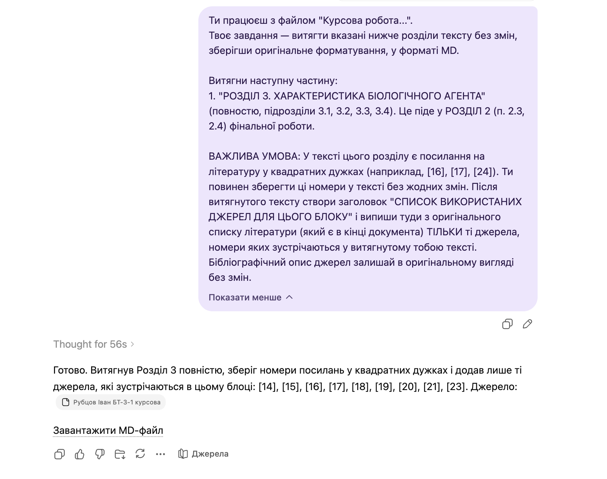

# Промпт витягу з курсової роботи

`Language: UK` `Промпти для витягу` `Source file: Курсова робота_для витягу.md`

## Що це за промпт

Український промпт для дослівного витягу потрібних розділів із файлу курсової роботи.

## Для чого саме

Використовується для збереження оригінальних розділів курсової для подальшого синтезу або карти цитувань.

## Що можна отримати

- Дослівні витяги розділів
- Збереження оригінального форматування
- Чіткі межі витягу

## Очікувані результати

- Менше відхилення від джерела
- Легше повторне використання у великих workflow
- Надійніше збирання

## Що підготувати

- Файл курсової роботи
- Список розділів

## Як використовувати

- Відкрийте потрібну мовну версію.
- Скопіюйте блок промпту повністю.
- Додайте файли або посилання, які промпт очікує як вхідні дані.
- Після першого запуску уточніть змінні, які модель попросить конкретизувати.

## Промпт

Текст промпту

~~~markdown
Ти працюєш з файлом "Курсова робота...". 
Твоє завдання — витягти вказані нижче розділи тексту без змін, зберігши оригінальне форматування, у форматі PDF.

Витягни наступні частини:
1. "РОЗДІЛ 1. ХАРАКТЕРИСТИКА ЦІЛЬОВОГО ПРОДУКТУ БІОСИНТЕЗУ" (повністю). Це піде у РОЗДІЛ 1 фінальної роботи.
2. "РОЗДІЛ 2. ОБГРУНТУВАННЯ ВИБОРУ БІОЛОГІЧНОГО АГЕНТА" (повністю). Це піде у РОЗДІЛ 2 (п. 2.1, 2.2) фінальної роботи.
3. З "РОЗДІЛ 3" витягни тільки підрозділи "3.1. Вибір умов і способу біосинтезу..." та "3.2. Вибір типу ферментера". Це піде у РОЗДІЛ 5 (п. 5.1) фінальної роботи.

ВАЖЛИВА УМОВА: У тексті цих розділів є посилання на літературу у квадратних дужках (наприклад, [2], [6]). Ти повинен зберегти ці номери у тексті без жодних змін. Після витягнутого тексту створи заголовок "СПИСОК ВИКОРИСТАНИХ ДЖЕРЕЛ ДЛЯ ЦЬОГО БЛОКУ" і випиши туди з оригінального списку літератури (який є в кінці документа) ТІЛЬКИ ті джерела, номери яких зустрічаються у витягнутому тобою тексті. Бібліографічний опис джерел залишай в оригінальному вигляді без змін.
~~~

## Приклади та матеріали

Нижче додано відповідні PNG/PDF або PPTX матеріали для особистого ознайомлення з тим, що може генерувати або підтримувати цей промпт.

### Переглянути PNG demo: `9.png`

## Пов'язані версії

- [English version](../en/coursework-extraction.md)
- [Category: Промпти для витягу](../../categories/extraction-prompts.md)
- [All prompts](../../prompts/index.md)

## Джерело

Original local source: [Курсова робота_для витягу.md](../../source/%D0%9A%D1%83%D1%80%D1%81%D0%BE%D0%B2%D0%B0%20%D1%80%D0%BE%D0%B1%D0%BE%D1%82%D0%B0_%D0%B4%D0%BB%D1%8F%20%D0%B2%D0%B8%D1%82%D1%8F%D0%B3%D1%83.md)
