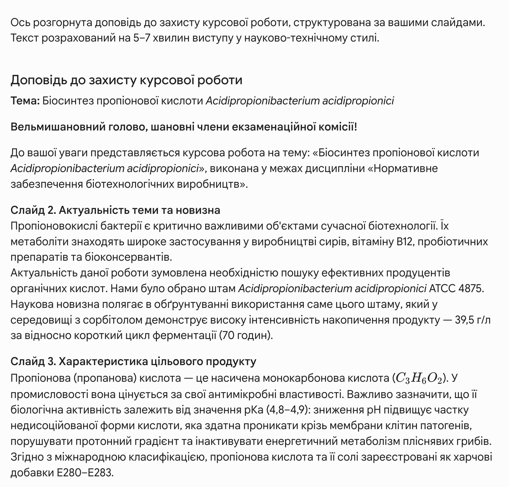

# Текстова доповідь до захисту з презентації

`Language: UK` `Академічні презентації` `Source file: Текстова доповідь.md`

## Що це за промпт

Український промпт для створення текстової доповіді на 5-7 хвилин на основі прикріпленої презентації.

## Для чого саме

Використовується для перетворення слайдів на зв'язний усний текст захисту.

## Що можна отримати

- Текст доповіді до захисту
- Нарація по слайдах
- Формулювання з урахуванням часу

## Очікувані результати

- Зв'язніший усний виступ
- Кращі переходи між слайдами
- Чіткіший таймінг захисту

## Що підготувати

- Файл презентації
- Вимога щодо тривалості захисту

## Як використовувати

- Відкрийте потрібну мовну версію.
- Скопіюйте блок промпту повністю.
- Додайте файли або посилання, які промпт очікує як вхідні дані.
- Після першого запуску уточніть змінні, які модель попросить конкретизувати.

## Промпт

Текст промпту

~~~markdown
Проаналізовуй прикріплену презентацію.
Твоє завдання створити текстову доповідь до захисту на 5-7 хвилин на основі даних для кожного слайду в презентації. Стиль презентування - науково-технічний.
Зроби глибокий вдих та приступай до завдання максимально відповідально.
Без [cite_start] та інших [cite].
~~~

## Приклади та матеріали

Нижче додано відповідні PNG/PDF або PPTX матеріали для особистого ознайомлення з тим, що може генерувати або підтримувати цей промпт.

### Переглянути PNG demo: `4.png`

## Пов'язані версії

- [English version](../en/defense-speech-from-presentation.md)
- [Category: Академічні презентації](../../categories/academic-presentations.md)
- [All prompts](../../prompts/index.md)

## Джерело

Original local source: [Текстова доповідь.md](../../source/%D0%A2%D0%B5%D0%BA%D1%81%D1%82%D0%BE%D0%B2%D0%B0%20%D0%B4%D0%BE%D0%BF%D0%BE%D0%B2%D1%96%D0%B4%D1%8C.md)
