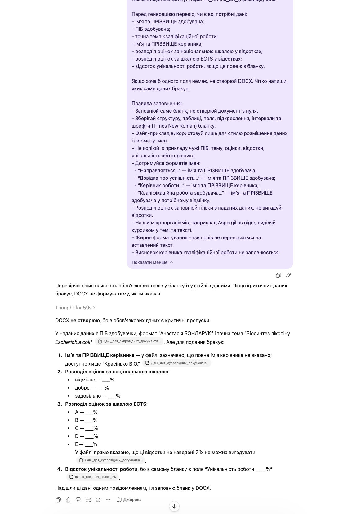
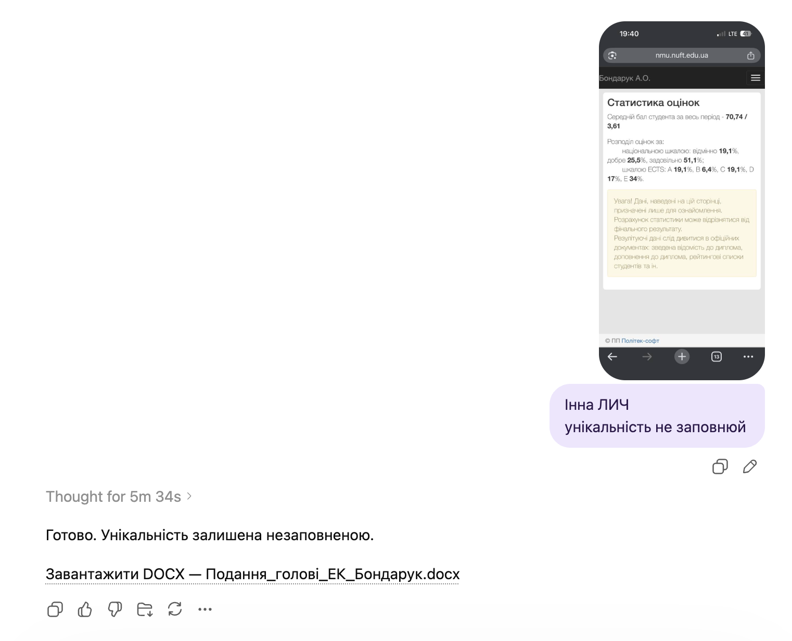

# Заповнення подання голові ЕК

`Language: UK` `Бланки кваліфікаційної роботи` `Source file: Мета-промпт_подання голові ЕК.md`

## Що це за промпт

Український промпт для заповнення подання голові екзаменаційної комісії щодо захисту роботи.

## Для чого саме

Використовується для підготовки адміністративного бланка для ЕК на основі даних роботи й прикладів.

## Що можна отримати

- Заповнене подання
- Поля, пов'язані із захистом
- Форматування за прикладом

## Очікувані результати

- Чистіший пакет документів до захисту
- Менший ризик пропусків
- Стабільніший адміністративний стиль

## Що підготувати

- Порожній DOCX подання
- DOCX-приклад
- Структуровані дані роботи

## Як використовувати

- Відкрийте потрібну мовну версію.
- Скопіюйте блок промпту повністю.
- Додайте файли або посилання, які промпт очікує як вхідні дані.
- Після першого запуску уточніть змінні, які модель попросить конкретизувати.

## Промпт

Текст промпту

~~~markdown
Твоє завдання: заповнити бланк подання голові екзаменаційної комісії щодо захисту кваліфікаційної роботи.

Вхідні файли:
1. Бланк подання голові ЕК DOCX.
2. Файл-приклад заповнення DOCX.
3. Загальні дані здобувача у текстовому форматі.

Формат виводу: DOCX.
Назва вихідного файлу: Подання_голові_ЕК_{Прізвище}.docx

Перед генерацією перевір, чи є всі потрібні дані:
- ім’я та ПРІЗВИЩЕ здобувача;
- ПІБ здобувача;
- точна тема кваліфікаційної роботи;
- ім’я та ПРІЗВИЩЕ керівника;
- розподіл оцінок за національною шкалою у відсотках;
- розподіл оцінок за шкалою ECTS у відсотках;
- відсоток унікальності роботи, якщо це поле є в бланку.

Якщо хоча б одного поля немає, не створюй DOCX. Чітко напиши, яких саме даних бракує.

Правила заповнення:
- Заповнюй саме бланк, не створюй документ з нуля.
- Зберігай структуру, таблиці, поля, підкреслення, інтервали та шрифти (Times New Roman) бланку.
- Файл-приклад використовуй лише для стилю розміщення даних і формату імен.
- Не копіюй із прикладу чужі ПІБ, тему, оцінки, відсотки, унікальність або керівника.
- Дотримуйся форматів імен:
  - “Направляється…” — ім’я та ПРІЗВИЩЕ здобувача у курсиві;
  - “Довідка про успішність…” — ім’я та ПРІЗВИЩЕ здобувача у курсиві;
  - “Секретар інституту (факультету)” — Аліна ПРИХОДЬКО у курсиві;
  - “Висновок керівника кваліфікаційної роботи…” — ім’я та ПРІЗВИЩЕ здобувача у курсиві;
  - “Керівник роботи…” — ім’я та ПРІЗВИЩЕ керівника у курсиві;
  - “Кваліфікаційна робота здобувача…” — ім’я та ПРІЗВИЩЕ здобувача у потрібному відмінку у курсиві.
- Розподіл оцінок заповнюй тільки з наданих даних, не вигадуй відсотки.
- Назви мікроорганізмів, наприклад Aspergillus niger, виділяй курсивом у темі та тексті.
- Жирне форматування назв полів не переноситься на вставлений текст.
- Висновок керівника кваліфікаційної роботи не заповнюється
~~~

## Приклади та матеріали

Нижче додано відповідні PNG/PDF або PPTX матеріали для особистого ознайомлення з тим, що може генерувати або підтримувати цей промпт.

### Переглянути PNG demo: `18.png`

### Переглянути PNG demo: `18.1.png`

## Пов'язані версії

- [English version](../en/examination-commission-submission-form-filler.md)
- [Category: Бланки кваліфікаційної роботи](../../categories/qualification-document-forms.md)
- [All prompts](../../prompts/index.md)

## Джерело

Original local source: [Мета-промпт_подання голові ЕК.md](../../source/%D0%9C%D0%B5%D1%82%D0%B0-%D0%BF%D1%80%D0%BE%D0%BC%D0%BF%D1%82_%D0%BF%D0%BE%D0%B4%D0%B0%D0%BD%D0%BD%D1%8F%20%D0%B3%D0%BE%D0%BB%D0%BE%D0%B2%D1%96%20%D0%95%D0%9A.md)
