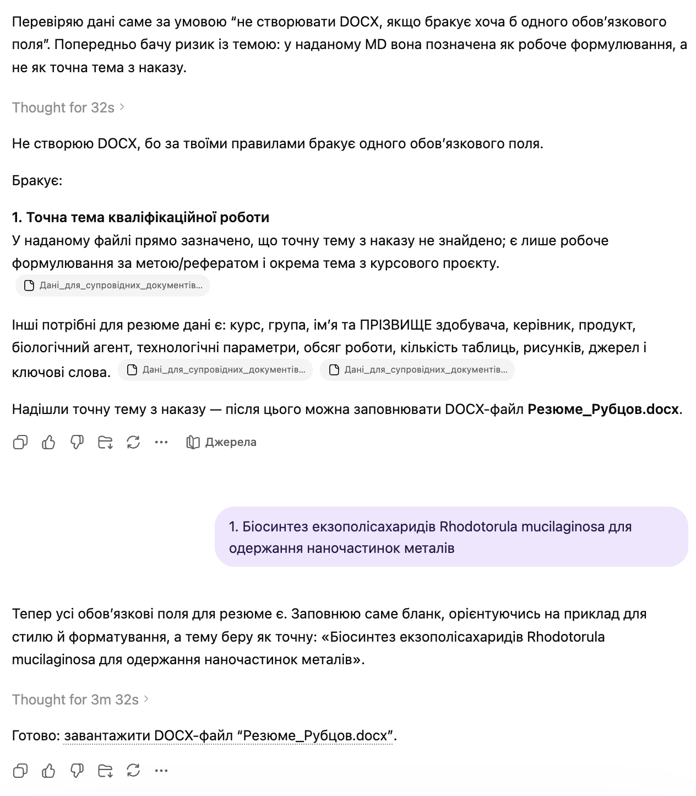

# Заповнення резюме до кваліфікаційної роботи

`Language: UK` `Бланки кваліфікаційної роботи` `Source file: Мета-промпт_резюме.md`

## Що це за промпт

Український промпт для заповнення резюме/анотації до кваліфікаційної роботи.

## Для чого саме

Використовується для створення стислого резюме з точними даними про продукт, організм, процес, обсяг і бібліографію.

## Що можна отримати

- Текст резюме/анотації
- Ключові слова
- Дані обсягу роботи
- Вказівки щодо блоку підпису

## Очікувані результати

- Конкретніші резюме
- Менше загальних тверджень
- Краща відповідність інституційним прикладам

## Що підготувати

- Порожній DOCX резюме
- DOCX-приклад
- Структуровані дані роботи

## Як використовувати

- Відкрийте потрібну мовну версію.
- Скопіюйте блок промпту повністю.
- Додайте файли або посилання, які промпт очікує як вхідні дані.
- Після першого запуску уточніть змінні, які модель попросить конкретизувати.

## Промпт

Текст промпту

~~~markdown
Твоє завдання: заповнити бланк резюме до кваліфікаційної роботи.

Вхідні файли:
1. Бланк резюме DOCX.
2. Файл-приклад заповнення DOCX.
3. Загальні дані здобувача у текстовому форматі.

Формат виводу: DOCX.
Назва вихідного файлу: Резюме_{Прізвище}.docx

Перед генерацією перевір, чи є всі потрібні дані:
- точна тема кваліфікаційної роботи;
- курс;
- група;
- ім’я та ПРІЗВИЩЕ здобувача;
- ПІБ або ініціали керівника у потрібному форматі;
- точний продукт / об’єкт роботи;
- біологічний агент або мікроорганізм;
- ключові технологічні параметри роботи;
- обсяг роботи в сторінках;
- кількість таблиць;
- кількість рисунків;
- кількість джерел;
- ключові слова або достатньо даних для їх формування.

Якщо хоча б одного поля немає, не створюй DOCX. Чітко напиши, яких саме даних бракує.

Правила заповнення:
- Заповнюй саме бланк, не створюй документ з нуля.
- Зберігай структуру, поля, інтервали, шрифти (Times New Roman) й розміщення з бланку.
- Файл-приклад використовуй для стилю резюме: коротка анотація, стислий вступ, практична/наукова цінність, обсяг роботи, ключові слова.
- Не копіюй із прикладу чужі ПІБ, тему, продукт, мікроорганізм, параметри виробництва чи кількість сторінок.
- Назва теми в резюме має бути курсивом.
- Назви мікроорганізмів, наприклад Aspergillus niger, виділяй курсивом у всьому документі.
- Дотримуйся форматів імен:
  - ім’я та ПРІЗВИЩЕ здобувача у курсиві;
  - “Керівник…” — прізвище та ініціали керівника у курсиві;
- Анотація має бути конкретною, не загальною. Включи точні дані з наданого тексту: цільовий продукт, мікроорганізм/штам, метод культивування, призначення продукту, об’єм ферментера або інші розрахункові параметри, обсяг роботи, кількість таблиць, рисунків і джерел.
- У рядку ключових слів жирним курсивом виділяй лише фразу “Ключові слова:”. Самі ключові слова пиши звичайним стилем, окрім назв мікроорганізмів, які мають бути курсивом.
- Блок “Виконав: здобувач…”, включно з ПІБ здобувача та місцем для підпису, має бути вирівняний праворуч, як у прикладі.
- Жирне форматування назв полів не переноситься на вставлений текст.
~~~

## Приклади та матеріали

Нижче додано відповідні PNG/PDF або PPTX матеріали для особистого ознайомлення з тим, що може генерувати або підтримувати цей промпт.

### Переглянути PNG demo: `20.png`

## Пов'язані версії

- [English version](../en/qualification-summary-form-filler.md)
- [Category: Бланки кваліфікаційної роботи](../../categories/qualification-document-forms.md)
- [All prompts](../../prompts/index.md)

## Джерело

Original local source: [Мета-промпт_резюме.md](../../source/%D0%9C%D0%B5%D1%82%D0%B0-%D0%BF%D1%80%D0%BE%D0%BC%D0%BF%D1%82_%D1%80%D0%B5%D0%B7%D1%8E%D0%BC%D0%B5.md)
