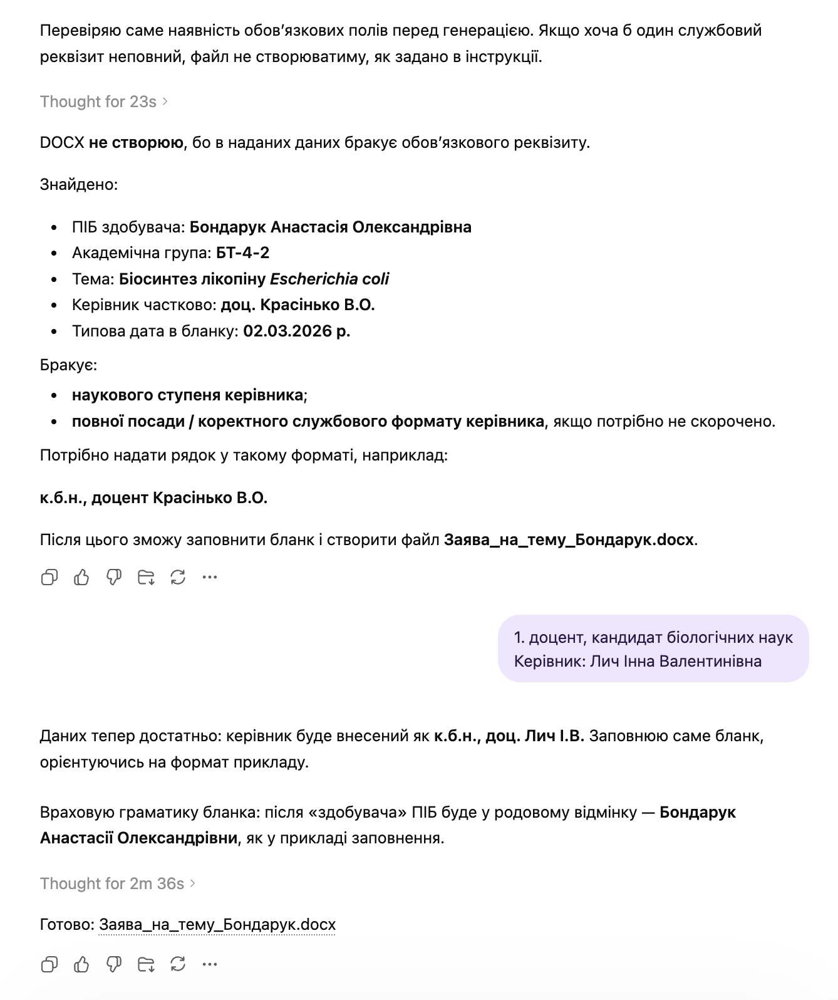

# Заповнення заяви на затвердження теми

`Language: UK` `Бланки кваліфікаційної роботи` `Source file: Мета-промпт_заява.md`

## Що це за промпт

Український промпт для заповнення заяви на затвердження теми кваліфікаційної роботи.

## Для чого саме

Використовується для перенесення метаданих роботи у правильний стиль адміністративного бланка.

## Що можна отримати

- Заповнена заява
- Мапінг теми й даних здобувача
- Узгодження форматування

## Очікувані результати

- Менше ручних помилок у бланку
- Послідовні формулювання
- Ближча відповідність прикладу

## Що підготувати

- Порожній DOCX заяви
- DOCX-приклад
- Дані теми роботи

## Як використовувати

- Відкрийте потрібну мовну версію.
- Скопіюйте блок промпту повністю.
- Додайте файли або посилання, які промпт очікує як вхідні дані.
- Після першого запуску уточніть змінні, які модель попросить конкретизувати.

## Промпт

Текст промпту

~~~markdown
Твоє завдання: заповнити бланк заяви на затвердження теми кваліфікаційної роботи.

Вхідні файли:
1. Бланк заяви DOCX.
2. Файл-приклад заповнення DOCX.
3. Загальні дані здобувача у текстовому форматі.

Формат виводу: DOCX.
Назва вихідного файлу: Заява_на_тему_{Прізвище}.docx

Перед генерацією перевір, чи є всі потрібні дані:
- ПІБ здобувача повністю;
- академічна група;
- точна тема кваліфікаційної роботи;
- науковий ступінь / посада / прізвище та ініціали керівника;
- дата заяви, якщо вона має відрізнятися від типової.

Якщо хоча б одного поля немає, не створюй DOCX. Чітко напиши, яких саме даних бракує.

Правила заповнення:
- Заповнюй саме бланк, не створюй документ з нуля.
- Зберігай структуру, поля, підкреслення, інтервали, шрифт (Times New Roman) та форматування бланку.
- Файл-приклад використовуй лише для стилю заповнення ПІБ, теми, групи й керівника.
- Не копіюй із прикладу чужі ПІБ, тему, групу, дату чи керівника.
- Дотримуйся форматів імен:
  - ПРІЗВИЩЕ ім’я по батькові здобувача у курсиві;
  - “призначити керівником роботи…” — прізвище та ініціали керівника у курсиві;
- Назва теми заяви має бути курсивом.
- Назви мікроорганізмів, наприклад Aspergillus niger, виділяй курсивом у темі.
- Керівника подавай у форматі: науковий ступінь / посада + прізвище та ініціали.
- Жирне форматування назв полів не переноситься на вставлений текст у пропусках.
~~~

## Приклади та матеріали

Нижче додано відповідні PNG/PDF або PPTX матеріали для особистого ознайомлення з тим, що може генерувати або підтримувати цей промпт.

### Переглянути PNG demo: `23.png`

## Пов'язані версії

- [English version](../en/qualification-topic-application-form-filler.md)
- [Category: Бланки кваліфікаційної роботи](../../categories/qualification-document-forms.md)
- [All prompts](../../prompts/index.md)

## Джерело

Original local source: [Мета-промпт_заява.md](../../source/%D0%9C%D0%B5%D1%82%D0%B0-%D0%BF%D1%80%D0%BE%D0%BC%D0%BF%D1%82_%D0%B7%D0%B0%D1%8F%D0%B2%D0%B0.md)
